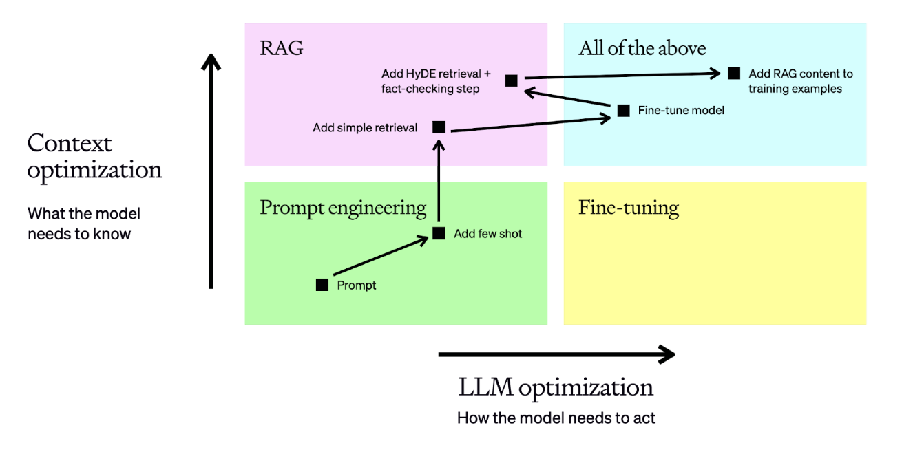

# AIApplicationEngineer
AIApplicationEngineer 人工智能应用工程师

## 引言
在这个快速发展的人工智能时代，在ChatGPT Deepseek等大模型快速退出，并能应用解决现实世界中的问题的时候,我们每个人都应该使用AI工具为自己赋能，如冷兵器时代的弓箭，热兵器时代的火枪，御敌千米之外。本教程旨在为初学者和中级开发者提供一个全面的学习路径，从基础概念到高级实现技巧。
## LLM的分类
AI模型的分类确实非常多样，每种类型的模型都有其独特的功能和应用场景。下面我将详细介绍几种常见的AI大模型类别,文本处理模型,图像生成模型,语音转文字模型,
嵌入模型（Embedding Models）,多模态模型,也需要对这些模型进行一些了解。
### 自然语言模型-NLP模型
这类模型主要处理和理解人类语言，包括文本生成、翻译、情感分析、文本摘要、问答系统等。典型的ChatGPT和Deepseek。
### 图像生成模型
OpenAI的DALL-E
DALL-E 是一个基于变换器的神经网络模型，能够生成与给定文本描述相匹配的图像。它的名字来源于艺术家萨尔瓦多·达利和PIXAR的动画电影《机器人总动员》（WALL-E）。
Google的Imagen
Imagen 是Google推出的一个高分辨率图像生成模型，它使用了称为Transformer的文本编码器和扩散模型来生成图像。Imagen以其生成图像的高质量和细节而闻名。
Stable Diffusion
Stable Diffusion 是一个开源的文生图模型，它使用扩散模型来生成图像。这个模型因其开放性和可定制性受到了广泛的欢迎，社区活跃，应用也非常广泛。
### 语音转文字模型
microsoft的speecht5_tts
Microsoft 的 SpeechT5_TTS 模型是一个基于 Transformer 的文本到语音（TTS）模型，它是 SpeechT5 模型家族的一部分。这个模型利用了自然语言处理中的最新技术，特别是 Transformer 架构，来生成高质量、自然 sounding 的语音。
### 嵌入模型 Embedding模型
嵌入式模型的核心思想是将每个数据点映射到一个低维度的嵌入向量（embedding vector）中，使得相似的数据点在嵌入空间中距离接近。
Contriever, OpenAI Embeddings, BAAI BGE等方法采用多阶段训练策略。
### 多模态模型
多模态模型是指能够处理和理解多种类型数据（如文本、图像、声音等）的模型。这些模型通过整合来自不同模态的信息，能够提供更为丰富和准确的分析和预测。
NExT-GPT
这是一种端到端、通用且支持任意模态到任意模态的 MM-LLM，支持自由输入和输出图像、视频、音频和文本。其采用了一种轻量的对齐策略 —— 在编码阶段使用以 LLM 为中心的对齐，在解码阶段使用指令遵从对齐。
Video-LLaMA
提出了一种多分支跨模态预训练框架，让 LLM 可以在与人类对话的同时处理给定视频的视觉和音频内容。该框架对齐了视觉与语言以及音频与语言。

## 用好大模型
经常会遇到有些人有反馈 大模型不好用,大模型回答的不正确,答非所问浪费我的时间。。。
这是LLM准确度的一个问题。如何在使用 LLM 时最大限度地提高正确性和一致性行为？
本文给出了一个关于如何优化 LLM 以提高准确性和行为的思维模型。我们将探讨诸如提示工程、RAG检索增强生成 和微调等方法。

图1-1 LLM优化矩阵

典型的 LLM 任务将从左下角的快速工程开始，我们在此进行测试、学习和评估以获得基准。
- 上下文优化的场景
1. 模型缺乏上下文知识（不在训练集中）
2. 知识已过时
3. 专有信息知识
- LLM 优化场景
1. 模型产生的结果不一致且格式不正确
2. 语气或说话风格不正确
3. 推理没有遵循正确逻辑

## 提示工程指南
### 提示工程背景
提示工程（Prompt Engineering）是一门较新的学科，关注提示词开发和优化，帮助用户将大语言模型（Large Language Model, LLM）用于各场景和研究领域。 掌握了提示工程相关技能将有助于用户更好地了解大型语言模型的能力和局限性。提示工程主要是在理解大语言模型能力的基础上设计和研发提示词。
在开始前我们先从几个模型设置参数了解一下大语言模型的生成规则。不同的客户端参数配置在不同的地方，常见的是大模型上有个设置按钮。
1. Temperature,范围0-1,temperature 的参数值越小，模型就会返回越确定的一个结果。如果调高该参数值，大语言模型可能会返回更随机的结果，也就是说这可能会带来更多样化或更具创造性的产出。比如专业知识问答需要固定确定的答案需要调小temperature,写作创作等灵活问答需要更多创造性的答案建议调大temperature。
2. Top_p,范围0-1,与temperature类似,Top P意味着只有词元集合（tokens）中包含top_p概率质量的才会被考虑用于响应,与 temperature 一起称为核采样（nucleus sampling）的技术。
一般建议是改变 Temperature 和 Top P 其中一个参数就行，不用两个都调整。
3. Max Length,max length来控制大模型生成的 token 数，设置合适的max length有助于防止大模型生成冗长或不相关的响应。
4. Stop Sequences,字符串,stop sequences 是控制大模型响应长度和结构的一种方式,比如生成项目列表有12项，我们只需要其中的10项,设置11为stop sequences,在生成11的时候就会自动停止生成。
5. Frequency Penalty,字符串,设置再次出现的可能性就越小。比如生成的回答中出现了大量重复的词，我们又不需要可以设置该词减少重复的输出。
6. Presence Penalty,字符串,与Frequency Penalty类似。都是对生成重复的词进行惩罚,不同的是惩罚规则不同,Presence Penalty会对出现2次和出现10次是相同的惩罚。一般建议是改变frequency penalty和 presence penalty 其中一个参数就行，不要同时调整两个。

提示词可以包含以下任意要素：
指令：想要模型执行的特定任务或指令。
上下文：包含外部信息或额外的上下文信息，引导语言模型更好地响应。
输入数据：用户输入的内容或问题。
输出指示：指定输出的类型或格式。

提示词：
问题:  介绍一下prompt。
输出：
答案: 在计算机科学和人工智能领域，特别是在与像我这样的语言模型交互时，"prompt"指的是用户输入的文本，这些文本旨在引导或激发模型生成特定的回答或输出。
例如，当你问我“介绍一下prompt”时，这个问题本身就是一个prompt，它指导我如何回答你的问题。在编程和脚本语言中，prompt也可以指命令行界面中等待用户输入的文本提示符。总的来说，prompt是一种工具，用于引导对话或操作的方向。
### 提示工程技巧
从开始设计提示词的时候,实际上是一个迭代过程，需要大量的实验才能获得最佳结果。
#### 更准确清晰的说明
一段简短的文字描述其意含糊不清，往往大模型给出的答案不令人满意，这样的情况下我们主要使用 背景-现状-要求的方式进行提示。
| Bad | Good     |
|    :----:   |          :---: |
| 如何在Excel中添加数字累加和 | 我要一张Excel表,B列为总费用,我现在需要对B2到B9的数据进行总计求和的操作,给出完整的excel公式 |
| 总结会议记录 | 用一段话总结会议记录,然后写下演讲者及其要点的简要列表。最后，列出演讲者的总结和建议或者后续的行动 |
| 编写代码计算斐波那契数列 | 编写一个TypeScript函数来高效计算斐波那契数列。对代码进行大量注释，解释每个部分的作用以及为什么这样编写。 |

#### 提供参考文本
| Bad | Good     |
|    :----:   |          :---: |
| 我需要把excel里面的一列格式月.日修改为 2024.月.日 给出公式 | 我需要把excel里面的一列格式月.日修改为 2024.月.日,比如 6.30->2024.6.30,7.1->2024.7.1,给完整的excel公式 |

#### 补充模型应该的角色
可以使用三个不同的角色来构建prompt：system、user和assistant。其中system不是必需的，但有助于设定assistant的整体行为，帮助模型了解用户的需求，并根据这些需求提供相应的响应。

| Bad | Good     |
|    :----:   |          :---: |
| system:你是一位有用的助手 | 你是一位专业到且仔细的财务助手。您的目标是深入了解用户的意图，在回答用户费用问题时候，逐步思考复杂问题，提供清晰准确的答案，并主动预测有用的后续信息。|

#### 指定完成任务所需的步骤
有些任务最好以一系列步骤的形式来描述。明确地写出这些步骤可以让模型更容易遵循它们。
| Bad | Good     |
|    :----:   |          :---: |
| 我有一个月.日的时间格式需要进行加3个月的转换并输出转换后的时间,数据为 7.27 5.21 ... | 我有一个月.日的时间格式,需要第一步补充年的时间为 2024,第二步在转换后的时间格式基础上(年.月.日)上计算增加3个月,输出转换后的时间格式为 新的时间为: ,数据为 7.27 5.21 ... |

#### 指定需要输出长度
您可以要求模型生成具有给定目标长度的输出。目标输出长度可以根据单词、句子、段落、要点等的数量来指定。
| Bad | Good     |
|    :----:   |          :---: |
| 请总结下面的文本内容。 xxx | 请用一段话总结下面的文本100字以内。xxx |
| 请总结下面的文本内容。 xxx | 请用简洁的语言对文本进行总结并最后一句话总结核心观点。xxx |

#### 总结之前的对话
由于模型具有固定的上下文长度，因此用户和助手之间的对话，对于长对话内容，大预言模型对之前的内容可能被截断漏掉导致丢失了部分有效信息，一个比较好的方式是在一定交互后对之前的对话进行总结，这样启动总结有用信息过滤无用信息的作用。

| Bad | Good     |
|    :----:   |          :---: |
| 多轮会话继续提问 | 多轮会话后进行总结后再提问 |

#### 其他
还有很多其他的方式,比如指导模型按思维链的方式进行逐步思考，将复杂任务拆分为子任务等，具体可以参考下面的链接
https://platform.openai.com/docs/guides/prompt-engineering#tactic-specify-the-desired-length-of-the-output

## RAG检索增强生成
###

